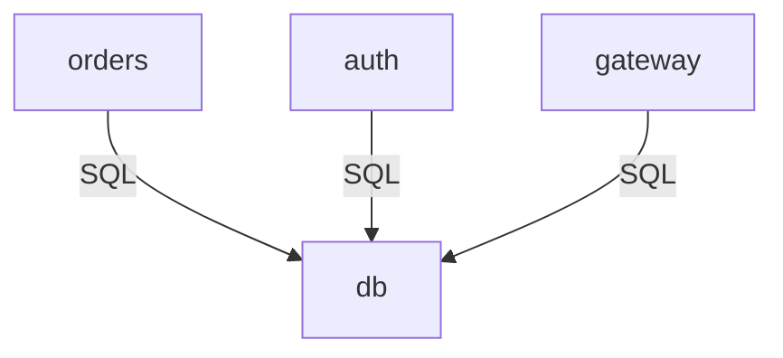

# Archinix

Architecture as code. Define your system **once** in Nix — a component tree and
Mermaid sequence diagrams — and generate a set of interlinked Markdown pages
with embedded Mermaid diagrams.

The key idea: **the sequence diagrams are the source of truth**. The architecture
flowcharts are *derived* from the messages exchanged in the sequences, so a
change to a flow automatically propagates to every architecture view. No more
hand-maintaining parallel diagrams.

- Architecture diagrams → Mermaid `flowchart`
- Sequence diagrams → native Mermaid `sequenceDiagram`
- Output → Markdown files with fenced Mermaid blocks and relative cross-links

## Quick start

Instantiate the project (library + example model + generated docs) and render it:

```console
$ nix flake init -t github:hallundbaek/archinix
$ nix run .#render          # writes ./docs
$ ls docs
architecture.md  login-flow.md  login-flow-architecture.md  README.md  ...
```

If you already cloned this repository, initialise from the local path instead:

```console
$ nix flake init -t .
```

The generated pages are meant to be committed to your repository; GitHub, GitLab
and Forgejo render the fenced `mermaid` blocks natively.

Then edit `model/default.nix` to describe your own system and re-run
`nix run .#render`.

## Project layout

```
.
├── flake.nix              # apps, packages and checks
├── lib/                   # the renderer library (pure nixpkgs.lib)
│   ├── mermaid.nix        # low-level Mermaid primitives
│   ├── components.nix     # component tree + validation
│   ├── sequence.nix       # sequence diagrams
│   ├── architecture.nix   # derives architecture from sequences
│   ├── markdown.nix       # page assembly and cross-links
│   ├── preview/           # live preview server (Markdown + Mermaid)
│   └── default.nix        # public API
├── model/default.nix      # YOUR architecture lives here
└── docs/                  # generated, committed
```

## Commands

| Command | Description |
| --- | --- |
| `nix run .#render` | Regenerate `./docs` from `model/`. |
| `nix run .#render -- docs --check` | Fail if `./docs` is out of date (for CI). |
| `nix run .#watch` | Watch `model/` + `lib/`, re-render, and serve a live HTML preview in your browser. |
| `nix build .#docs` | Build the generated Markdown as a derivation. |
| `nix run .#check-mermaid` | Render every diagram with `mermaid-cli` to catch invalid output. |
| `nix flake check` | Runs the `docs-up-to-date` check (pure Nix, no browser). |
| `nix develop` | Dev shell with `nixfmt`, `nixd`, `mermaid-cli`. |

### Live preview

```console
$ nix run .#watch
[archinix] initial render
[archinix] serving http://127.0.0.1:8080/ (Ctrl-C to stop)
```

This watches `model/` (and `lib/`) for changes, re-renders `./docs` on every
change, serves the result as **rendered HTML** — Markdown is converted with
[python-markdown](https://python-markdown.github.io/) and the Mermaid blocks are
rendered client-side — and automatically opens the page in your browser. The
browser reloads itself whenever the docs change, so you always see the newest
version. The preview follows your OS light/dark preference (and reloads when it
changes); append `?theme=dark` or `?theme=light` to any URL to force a theme.
Flags: `--port N`, `--root DIR`, `--no-open`.

## Defining components

`components` is a recursive tree. A node with a `components` attribute is a
**boundary**; a node without one is a **component leaf**. Leaves are what
sequences reference. Define leaves once with `component.define` to get handles
(their attribute name becomes the id), then use `c.<name>` everywhere:

```nix
let
  c = component.define {
    user = component.actor "End User";
    web = component.boundary "Web App";
    gateway = component.control "API Gateway";
    db = component.database "PostgreSQL" // {
      links = [ (link "Metrics" "https://grafana.example/db") ];
    };
    queue = component.queue "Job Queue";
  };
in
{
  components = {
    internet = boundary "Internet" { inherit (c) user; };
    edge = boundary { label = "Edge / DMZ"; color = "#2d333b"; } { inherit (c) web; };
    core = boundary { label = "Core Services"; color = "rgb(45, 55, 72)"; } {
      inherit (c) gateway db;
      workers = boundary "Worker Pool" { inherit (c) queue; };
    };
  };
}
```

- `component.define { name = node; ... }` — attaches each attribute name as the
  node's `id` and returns handles. `inherit (c) name;` places a handle in the
  tree under the matching key, and `c.name` is accepted anywhere a component is
  referenced (messages, notes, activations, `create`/`destroy`, `properties`/
  `details`, and an explicit `participants` list). A handle `id` that does not
  match its tree key is a validation error.
- `boundary label children` — a boundary; `boundary { label; color; } children`
  adds a colour. Boundaries may nest.
- `component.<kind> label` — a leaf. Add metadata with `//`, e.g.
  `component.database "PostgreSQL" // { links = [ ... ]; }`. `<kind>` is any name
  from the table below (`component.make` if you need full control).
- `component.<kind> [ types ] label` — the same, with one or more semantic
  `types` (see [Semantic types](#semantic-types)); `component.of [ types ] label`
  derives the kind from the types instead.
- `link label url` — an actor-menu entry for a leaf's `links`.

Plain id strings still work everywhere, and the equivalent raw form (a plain
node `{ label = "..."; kind = "..."; }` inside a
`{ label = "..."; components = { ... }; }` boundary) is also accepted.

Boundaries nest arbitrarily and render as nested `subgraph`s (architecture) and
as `box` groups (sequence diagrams, top level only). Leaves are grouped into the
sequence boxes by their top-level boundary.

### Component kinds

`kind` selects both the Mermaid participant stereotype and the architecture node
shape:

| `kind` | sequence stereotype | architecture shape |
| --- | --- | --- |
| `participant` | rectangle | rectangle |
| `actor` | actor figure | stadium |
| `boundary` | boundary | hexagon |
| `control` | control | circle |
| `entity` | entity | rectangle |
| `database` | database | cylinder |
| `collections` | collections | subroutine |
| `queue` | queue | parallelogram |

`links` adds a Mermaid actor menu entry (`link <id>: <label> @ <url>`). See the
caveats below: Mermaid crashes on menus for `actor`/`boundary`/`control`/`entity`
participants, so prefer them on `participant`/`database`/`collections`/`queue`.

### Semantic types

A component can additionally carry one or more **semantic types** (e.g.
`deployed-service`) — a second axis beside the visual `kind`. Declare a `types`
registry and give components types:

```nix
let
  ty = types.define {
    deployed-service = { label = "Deployed Service"; color = "#3182ce"; };
    queue-consumer   = { label = "Queue Consumer"; kind = "queue"; color = "#38a169"; };
    database         = { label = "Database"; kind = "database"; color = "#805ad5"; };
  };

  c = component.define {
    gateway = component.control     [ ty.deployed-service ]       "API Gateway";
    auth    = component.participant [ ty.deployed-service ]       "Auth Service";
    db      = component.database    [ ty.database ]               "PostgreSQL";
    worker  = component.collections [ ty.deployed-service ty.queue-consumer ] "Worker";
    # component.of derives the kind from the types instead of naming it:
    queue   = component.of          [ ty.queue-consumer ]         "Job Queue";
  };
in
{
  types = ty;                       # the registry the renderer consumes
  components = { /* ... inherit (c) ... */ };
}
```

- Type fields: `label` (required), `kind` (optional, used only when the type
  appears as an actor in a sequence diagram; default `participant`), and `color`
  (optional). Type ids may contain hyphens and must not collide with component ids.
- `component.<kind> [ types ] label` sets an explicit kind; type `kind`s are
  ignored for the component. `component.of [ types ] label` derives the kind from
  the types (error if none or several disagree).
- A component's **colour** comes from its types when they agree, or from an
  explicit `color`. More than one distinct type colour, with no explicit
  `color`, is an error. Explicit `kind`/`color` silence a conflict.
- A type's `label` is never inherited by a component.

**Type-level sequences** use types as actors. The sequence page shows the
abstract types; the architecture views expand each type endpoint to **all** its
concrete components (the cross product, self-edges dropped), so one sequence
covers every component of that type:

```nix
sequences.service-calls-db = {
  title = "Service → Database";
  participants = [ ty.deployed-service ty.database ];
  steps = [ (message.solidArrow ty.deployed-service ty.database "query") ];
};
```



`architecture.edgeLabels` may use a type pair (`"deployed-service->database"`,
applied to every expansion) or a concrete pair (`"orders->db"`, which overrides).
A type used by a sequence must have at least one instance, and a type cannot be
used with `create`/`destroy`.

## Defining sequences

```nix
sequences.login-flow = {
  title = "Login Flow";
  diagramTitle = "Login";
  description = ''
    Credentials are checked against PostgreSQL.

    - Invalid credentials return **401**.
  '';
  autonumber = { start = 10; increment = 5; };   # or true | false | "off"
  config = { theme = "redux-color"; look = "neo"; sequence = { mirrorActors = true; }; };
  # participants is optional; see below.
  steps = [ /* ... */ ];
};
```

`title` becomes the page heading, and `description` is rendered as Markdown on
the generated page (between the heading and the diagram). Both also feed the
diagram's accessibility metadata: `accTitle` is taken from `title` and
`accDescr` from `description` — there is no separate `accessibility` attribute.

`participants` is optional. If omitted, it is **inferred from the steps** — the
order of first appearance of every actor referenced by messages, notes,
activations, `properties`/`details` and `create`/`destroy`. Participants declared
with `create` are left out of the top-level declarations (they are declared at
the point they are created). Boxes and stereotypes follow the inferred list, so
inference produces the same diagram as an explicit list. Provide `participants`
explicitly when you want to control the initial order; any referenced actor not
listed is appended automatically.

`config` is emitted verbatim as an `%%{init: ...}%%` directive — the form that
works on both GitLab and Forgejo.

### Step DSL

`model/default.nix` receives a small DSL as its `archinix` argument and opens it
with `with archinix;`, so components are referenced by handle (`c.web`) and steps
are written as function calls instead of nested attrsets:

```nix
{ archinix }:
with archinix;
let
  c = component.define {
    web = component.boundary "Web App";
    gateway = component.control "API Gateway";
    db = component.database "PostgreSQL";
  };
in
{
  sequences.login-flow = {
    title = "Login Flow";
    steps = [
      (message.solidArrow c.web c.gateway "POST /login")
      (message.dottedArrow c.web c.gateway "GET /resource")
      (activate c.gateway)
      (note.over c.gateway "validate")
      (loop "until fresh" [
        (message.dottedArrow c.gateway c.db "SELECT 1")
      ])
      (deactivate c.gateway)
    ];
  };
}
```

`message.<arrow>` takes `from`, `to` and either a label string or an attrset
with `label` plus any extras:

```nix
(message.solidArrow c.worker c.gateway { label = "status"; central = "target"; })
(message.solidArrow c.db c.worker { label = "ack"; deactivateSource = true; })
```

The available constructors:

| Constructor | Equivalent raw step |
| --- | --- |
| `message.<arrow> from to label` | `{ message = { inherit from to label; arrow = "<arrow>"; }; }` |
| `message.make { from; to; label; arrow; ...; }` | fully explicit message |
| `comment "text"` | `{ comment = "text"; }` |
| `note.over actor text`, `note.overTwo a b text`, `note.leftOf actor text`, `note.rightOf actor text`, `note.make args` | `{ note = ...; }` |
| `activate "id"` / `deactivate "id"` | `{ activate/deactivate = "id"; }` |
| `create "id"` / `destroy "id"` | `{ create/destroy = "id"; }` |
| `loop "label" steps`, `opt "label" steps`, `breakBlock "label" steps` | `{ loop/opt/break = { label; steps; }; }` |
| `rect "rgb(...)" steps` | `{ rect = { color; steps; }; }` |
| `branch "label" steps` | `{ label; steps; }` (used below) |
| `alt branches`, `par branches`, `parOver branches`, `critical branches` | `{ alt/par/parOver/critical = { branches = ...; }; }` |
| `properties { actor; text; }`, `details { actor; text; }` | `{ properties/details = ...; }` |

`<arrow>` is any name from the arrow table below. For `alt`/`par`/`parOver`/
`critical` the first branch's label is the block header and the
`else`/`and`/`option` keywords are generated for the remaining branches. The
`break` block helper is named `breakBlock` because `break` is a Nix builtin that
`with` cannot shadow.

### Step reference

The DSL builds these underlying steps; you can also write them directly:

| Step | Renders |
| --- | --- |
| `{ comment = "text"; }` | `%% text` |
| `{ message = { from; to; label; arrow; central; activateTarget; deactivateSource; }; }` | a message |
| `{ note = { position; actors; text; }; }` | `Note over/left of/right of` |
| `{ activate = "id"; }` / `{ deactivate = "id"; }` | activation bar |
| `{ create = "id"; }` / `{ destroy = "id"; }` | participant creation/destruction |
| `{ loop = { label; steps; }; }` | `loop ... end` |
| `{ opt = { label; steps; }; }` | `opt ... end` |
| `{ break = { label; steps; }; }` | `break ... end` |
| `{ rect = { color; steps; }; }` | background `rect ... end` |
| `{ alt = { label?; branches = [ { label; steps; } ... ]; }; }` | `alt` / `else` |
| `{ par = { label?; branches = [ ... ]; }; }` | `par` / `and` |
| `{ parOver = { label?; branches = [ ... ]; }; }` | `par_over` / `and` |
| `{ critical = { label?; branches = [ ... ]; }; }` | `critical` / `option` |
| `{ properties = { actor; text; }; }` | `properties <actor>: ...` |
| `{ details = { actor; text; }; }` | `details <actor>: ...` |

Notes: `position = "over"` accepts one or two actors; `"left"`/`"right"` accept
exactly one. Messages may set `activateTarget = true` (`+` shortcut) or
`deactivateSource = true` (`-` shortcut), and `central = "target" | "source" |
"both"` for central lifeline connections.

### Arrow types

`message.arrow` accepts any of the names below (default `solidArrow`). The text
on the right is the token that gets emitted:

```text
solidOpen                ->
dottedOpen               -->
solidArrow               ->>
dottedArrow              -->>
bidirSolid               <<->>
bidirDotted              <<-->>
solidCross               -x
dottedCross              --x
solidPoint               -)
dottedPoint              --)
solidTopHalf             -|\
dottedTopHalf            --|\
solidBottomHalf          -|/
dottedBottomHalf         --|/
revSolidTopHalf          /|-
revDottedTopHalf         /|--
revSolidBottomHalf       \|-
revDottedBottomHalf      \|--
solidTopStick            -\
dottedTopStick           --\
solidBottomStick         -//
dottedBottomStick        --//
revSolidTopStick         //-
revDottedTopStick        //--
revSolidBottomStick      \\-
revDottedBottomStick     \\--
```


## Architecture configuration

```nix
architecture = {
  title = "Acme Platform";
  direction = "TD";                # TD | LR | BT | RL
  labelMode = "explicit";          # explicit | derived | count | none
  sequenceOrder = [ "login-flow" "token-refresh" "job-processing" ];
  edgeLabels = {
    "web->gateway" = "HTTPS";      # only labels for edges actually produced
  };
  config = { look = "neo"; };      # -> %%{init}%% on architecture diagrams
};
```

Nodes and edges are computed from the sequences:

- **Nodes** are every declared participant, created participant and message
  endpoint, in first-appearance order.
- **Edges** are the distinct `from->to` pairs across all messages (including
  inside blocks); self-messages are dropped from the overview.
- `labelMode = "explicit"` shows a label only when `edgeLabels` provides one;
  `derived` joins the message texts, `count` shows the message count.

Per-sequence "component interaction" views are generated automatically from the
same rules, restricted to a single sequence.

## Generated docs and cross-linking

For sequences `login-flow` and `token-refresh`, `render` produces:

```
docs/
├── README.md                          # index, grouped by type
├── architecture.md                    # global derived flowchart
├── login-flow.md                      # sequence diagram
├── login-flow-architecture.md         # derived per-sequence flowchart
├── token-refresh.md
└── token-refresh-architecture.md
```

Every page gets a **Related** section with relative links, so the pages form a
navigable set. Each page includes an **Overview** link back to the docs index
(`README.md`); the architecture page also links to each sequence, and each
sequence links back to the architecture and to its own component view.

## Validation

`nix run .#render` (and anything using the library) fails evaluation with a
readable error for: unknown component ids, invalid `kind`/`arrow`/`position`/
`central` values, malformed notes, dangling `create`/`destroy`/`activate`
targets, created participants that are also declared, `edgeLabels` keys that no
message produces, and duplicate sequence slugs.

## Caveats

- **Actor menus under `securityLevel: 'strict'`** (Forgejo/Gitea) may not render;
  GitLab renders them. The model still expresses them.
- **Actor-menu links (`link`) crash Mermaid** for `actor`, `boundary`, `control`
  and `entity` participants (a Mermaid bug: `Cannot read properties of null
  (reading 'class')`). They render fine for `participant`, `database`,
  `collections` and `queue`. The example only uses them on safe kinds; the live
  preview detects the crash and re-renders that diagram without the menus, and
  `nix run .#check-mermaid` skips it rather than failing.
- **`destroy` quirk:** in Mermaid, a `destroy` must be the last statement
  involving that participant (the next statement must reference it). Keep
  `destroy` at the end of a sequence.
- **`participants` vs `create`:** a participant declared with `create` must not
  also appear in `participants`.
- **Type expansion is a global cross product:** one type-level message produces
  an edge for every source instance × target instance, so many instances yield
  many edges. Types used by a sequence must have at least one instance.
- **New files in a Git checkout:** Nix evaluates a Git flake from the tracked
  tree, so a newly added `model/*.nix` must be `git add`ed before `render` (or
  the `watch` preview) will see it. Edits to already-tracked files are picked up
  immediately.
