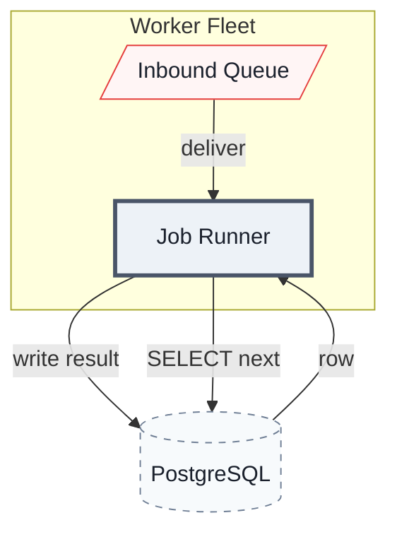

# Worker Fleet

```mermaid
flowchart TD
subgraph b_fleet["Worker Fleet"]
queue[/"Inbound Queue"/]
runner["Job Runner"]
end
anc_1_db[("PostgreSQL")]
queue -->|"deliver"| runner
runner -->|"write result"| anc_1_db
runner -->|"SELECT next"| anc_1_db
anc_1_db -->|"row"| runner
classDef actor fill:#eef0ff,stroke:#5a67d8,color:#1a202c
classDef participant fill:#eaf5ff,stroke:#3182ce,color:#1a202c
classDef boundary fill:#edf2f7,stroke:#4a5568,color:#1a202c
classDef control fill:#e6fffa,stroke:#319795,color:#1a202c
classDef entity fill:#fffaf0,stroke:#dd6b20,color:#1a202c
classDef database fill:#faf5ff,stroke:#805ad5,color:#1a202c
classDef collections fill:#f0fff4,stroke:#38a169,color:#1a202c
classDef queue fill:#fff5f5,stroke:#e53e3e,color:#1a202c
classDef composite fill:#edf2f7,stroke:#4a5568,stroke-width:3px,color:#1a202c
classDef ancestor fill:#f7fafc,stroke:#718096,stroke-dasharray:5,5,color:#1a202c
class queue queue
class runner composite
class anc_1_db ancestor
```

## Related

- [Overview](../README.md)
- [Up](../architecture.md)
- [Process Job](process.md)
- [Sub-architecture: Job Runner](runner/architecture.md)

