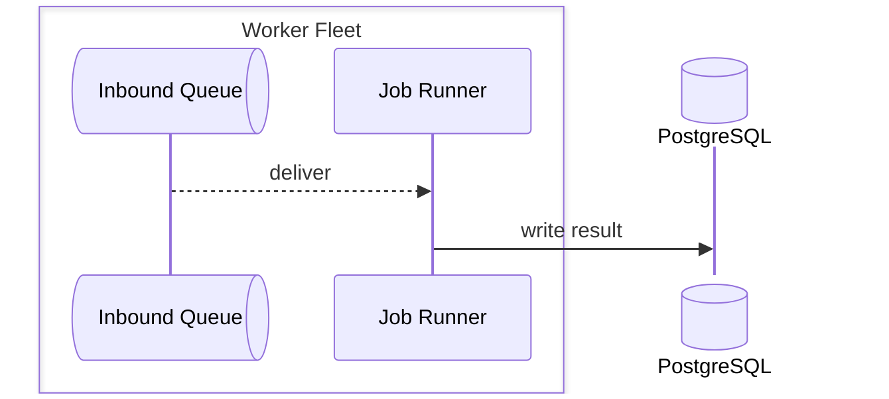

# Process Job

```mermaid
sequenceDiagram
accTitle: Process Job
box Worker Fleet
participant queue@{ "type": "queue" } as Inbound Queue
participant runner as Job Runner
end
participant anc_1_db@{ "type": "database" } as PostgreSQL
queue -->> runner: deliver
runner ->> anc_1_db: write result
```

## Related

- [Overview](../README.md)
- [Worker Fleet](architecture.md)
- [Process Job — Components](process-architecture.md)

