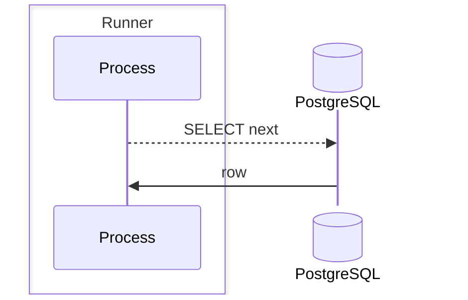

# Runner Tick

```mermaid
sequenceDiagram
accTitle: Runner Tick
box Runner
participant proc as Process
end
participant anc_2_db@{ "type": "database" } as PostgreSQL
proc -->> anc_2_db: SELECT next
anc_2_db ->> proc: row
```

## Related

- [Overview](../../README.md)
- [Job Runner](architecture.md)
- [Runner Tick — Components](tick-architecture.md)

