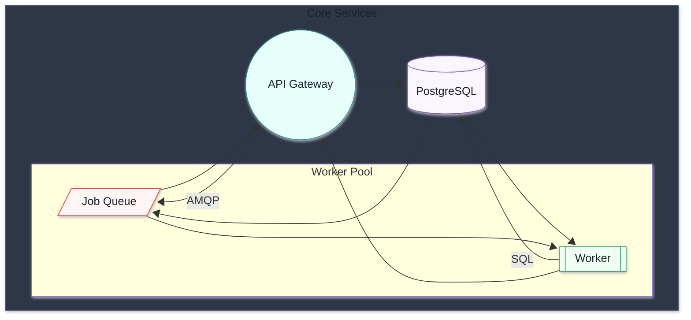

# Job Processing — Components

```mermaid
%%{init: {"look":"neo"} }%%
flowchart TD
subgraph b_core["Core Services"]
db[("PostgreSQL")]
gateway(("API Gateway"))
subgraph b_core_workers["Worker Pool"]
queue[/"Job Queue"/]
worker[["Worker"]]
end
end
db --> queue
db --> worker
gateway --> db
gateway -->|"AMQP"| queue
queue --> gateway
queue --> worker
worker -->|"SQL"| db
worker --> gateway
classDef actor fill:#eef0ff,stroke:#5a67d8,color:#1a202c
classDef participant fill:#eaf5ff,stroke:#3182ce,color:#1a202c
classDef boundary fill:#edf2f7,stroke:#4a5568,color:#1a202c
classDef control fill:#e6fffa,stroke:#319795,color:#1a202c
classDef entity fill:#fffaf0,stroke:#dd6b20,color:#1a202c
classDef database fill:#faf5ff,stroke:#805ad5,color:#1a202c
classDef collections fill:#f0fff4,stroke:#38a169,color:#1a202c
classDef queue fill:#fff5f5,stroke:#e53e3e,color:#1a202c
class gateway control
class queue queue
class db database
class worker collections
style b_core fill:#2D3748,stroke:#4a5568,color:#1a202c
```

## Related

- [Job Processing](./job-processing.md)
- [Acme Platform](./architecture.md)
