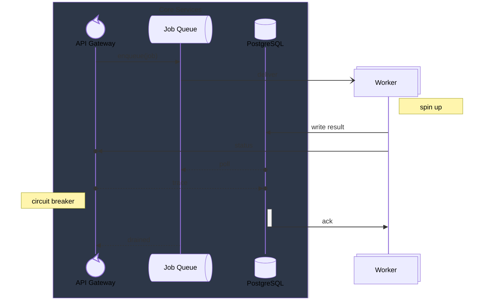

# Job Processing

```mermaid
sequenceDiagram
box rgb(45,55,72) Core Services
participant gateway@{ "type": "control" } as API Gateway
participant queue@{ "type": "queue" } as Job Queue
participant db@{ "type": "database" } as PostgreSQL
end
link db: Metrics @ https://grafana.example/db
gateway ->> queue: enqueue(job)
create participant worker@{ "type": "collections" } as Worker
queue -) worker: deliver
Note right of worker: spin up
worker ->> db: write result
worker ->>() gateway: status
db ()-->> queue: poll
gateway ()-->>() db: trace
Note left of gateway: circuit breaker
activate db
db ->>- worker: ack
queue -->> gateway: drained
destroy worker
```

## Related

- [Acme Platform](./architecture.md)
- [Job Processing — Components](./job-processing-architecture.md)
