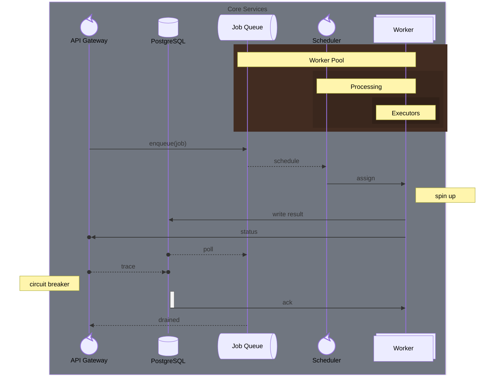

# Job Processing

```mermaid
sequenceDiagram
accTitle: Job Processing
box rgba(45,55,72,0.6) Core Services
participant gateway@{ "type": "control" } as API Gateway
participant db@{ "type": "database" } as PostgreSQL
participant queue@{ "type": "queue" } as Job Queue
participant scheduler@{ "type": "control" } as Scheduler
participant worker@{ "type": "collections" } as Worker
end
rect rgb(66,44,33)
Note over queue,worker: Worker Pool
rect rgba(0,0,0,0.12)
Note over scheduler,worker: Processing
rect rgba(0,0,0,0.16)
Note over worker: Executors
end
end
end
link db: Metrics @ https://grafana.example/db
gateway ->> queue: enqueue(job)
queue -->> scheduler: schedule
scheduler ->> worker: assign
Note right of worker: spin up
worker ->> db: write result
worker ->>() gateway: status
db ()-->> queue: poll
gateway ()-->>() db: trace
Note left of gateway: circuit breaker
activate db
db ->>- worker: ack
queue -->> gateway: drained
destroy worker
```

## Related

- [Overview](README.md)
- [Acme Platform](architecture.md)
- [Job Processing — Components](job-processing-architecture.md)

