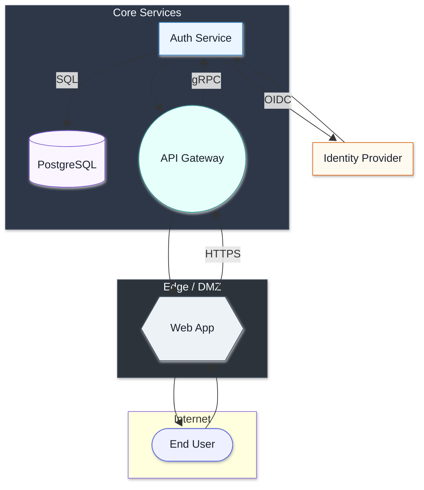

# Login Flow — Components

```mermaid
%%{init: {"look":"neo"} }%%
flowchart TD
subgraph b_core["Core Services"]
auth["Auth Service"]
db[("PostgreSQL")]
gateway(("API Gateway"))
end
subgraph b_edge["Edge / DMZ"]
web{{"Web App"}}
end
idp["Identity Provider"]
subgraph b_internet["Internet"]
user(["End User"])
end
auth -->|"SQL"| db
auth --> gateway
auth -->|"OIDC"| idp
gateway -->|"gRPC"| auth
gateway --> web
idp --> auth
user --> web
web -->|"HTTPS"| gateway
web --> user
classDef actor fill:#eef0ff,stroke:#5a67d8,color:#1a202c
classDef participant fill:#eaf5ff,stroke:#3182ce,color:#1a202c
classDef boundary fill:#edf2f7,stroke:#4a5568,color:#1a202c
classDef control fill:#e6fffa,stroke:#319795,color:#1a202c
classDef entity fill:#fffaf0,stroke:#dd6b20,color:#1a202c
classDef database fill:#faf5ff,stroke:#805ad5,color:#1a202c
classDef collections fill:#f0fff4,stroke:#38a169,color:#1a202c
classDef queue fill:#fff5f5,stroke:#e53e3e,color:#1a202c
class user actor
class web boundary
class gateway control
class auth participant
class db database
class idp entity
style b_core fill:#2D3748,stroke:#4a5568,color:#f7fafc
style b_edge fill:#2d333b,stroke:#4a5568,color:#f7fafc
```

## Related

- [Overview](./README.md)
- [Login Flow](./login-flow.md)
- [Acme Platform](./architecture.md)
