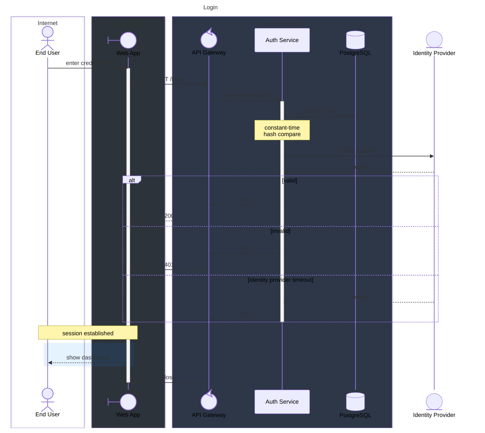

# Login Flow

End-user credentials are verified against PostgreSQL, with an optional
OIDC lookup at the identity provider.

- Invalid credentials return **401**.
- An unreachable identity provider returns **503**.

## Related

- [Overview](./README.md)
- [Acme Platform](./architecture.md)
- [Login Flow — Components](./login-flow-architecture.md)
