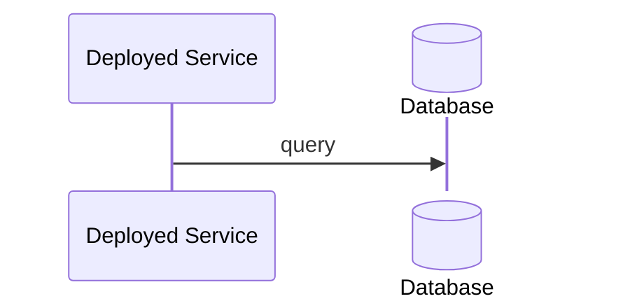

# Service → Database

Every deployed service queries the database.

This sequence is written once against the types; the architecture shows
the resulting **orders → db**, **auth → db** and **gateway → db** edges
without a sequence per service.

## Related

- [Overview](./README.md)
- [Acme Platform](./architecture.md)
- [Service → Database — Components](./service-calls-db-architecture.md)
