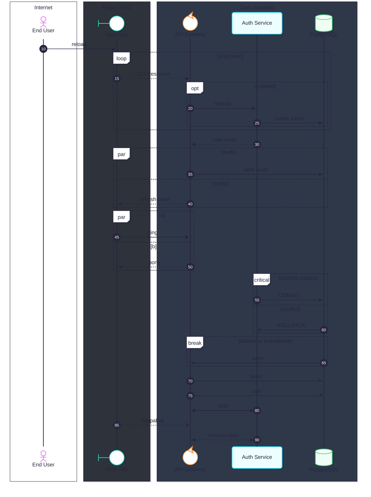

# Token Refresh

```mermaid
%%{init: {"look":"neo","sequence":{"mirrorActors":true},"theme":"redux-color"} }%%
sequenceDiagram
accTitle: Token Refresh
autonumber 10 5
box Internet
actor user as End User
end
box rgb(45,51,59) Edge / DMZ
participant web@{ "type": "boundary" } as Web App
end
box rgb(45,55,72) Core Services
participant gateway@{ "type": "control" } as API Gateway
participant auth as Auth Service
participant db@{ "type": "database" } as PostgreSQL
end
link auth: Runbook @ https://wiki.example/auth
link db: Metrics @ https://grafana.example/db
user ->> web: reload
loop until fresh
web -->> gateway: GET /resource
opt expired
gateway ->> auth: refresh
auth ->> db: rotate token
end
end
auth -->> gateway: new token
par audit
gateway ->> db: write audit
and notify
gateway -->> web: refresh done
end
par_over a
web ->> gateway: ping
and b
gateway -->> web: pong
end
critical commit rotation
auth ->> db: COMMIT
option conflict
db -x auth: ROLLBACK
end
break database unavailable
db -x gateway: error
end
gateway -|\ db: sync
db \|- gateway: ack
auth <<->> gateway: bidir
web --) gateway: keepalive
auth <<-->> gateway: session sync
```

## Related

- [Overview](./README.md)
- [Acme Platform](./architecture.md)
- [Token Refresh — Components](./token-refresh-architecture.md)
